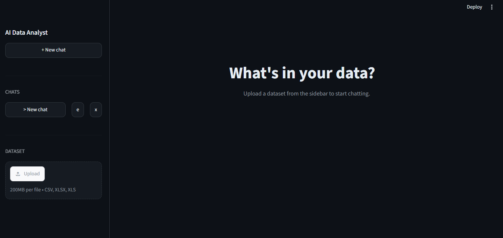
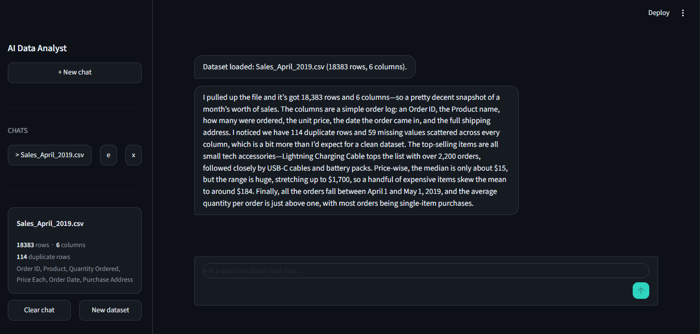
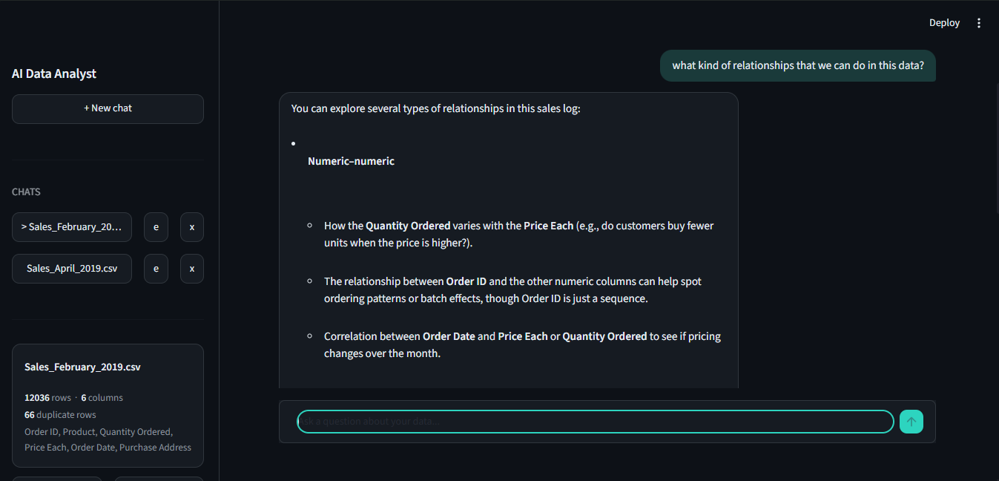
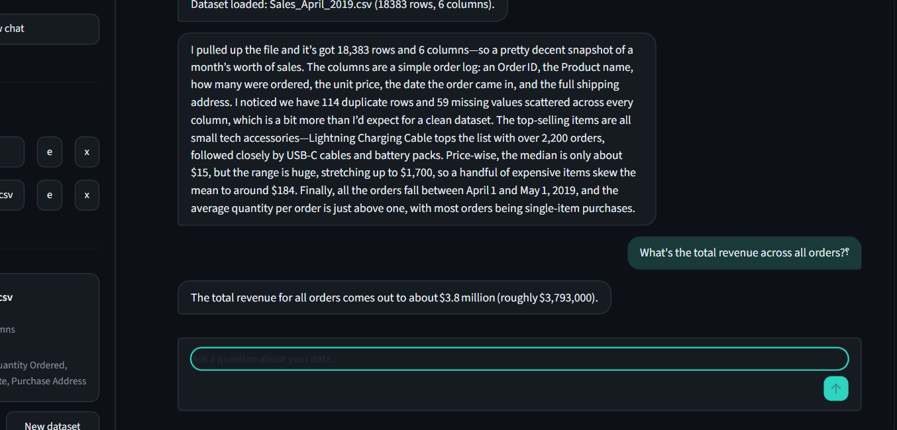
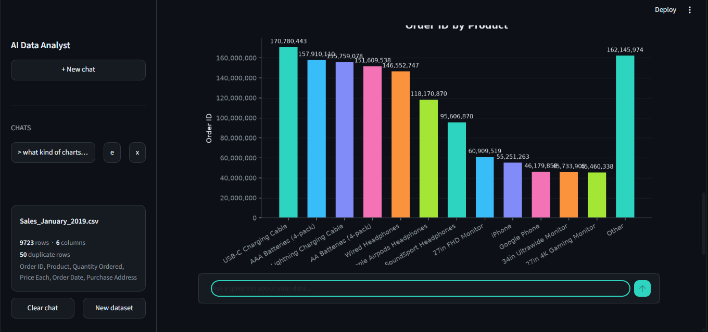
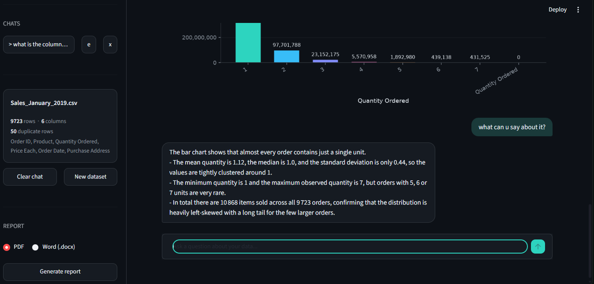
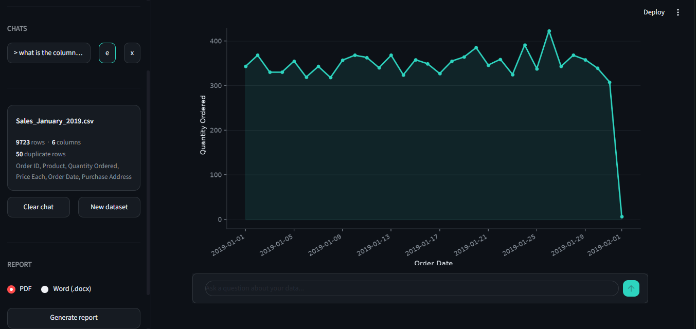

# AI Data Analyst Agent

A local-first AI agent that lets you upload a dataset (CSV or Excel) and chat with it in
plain English. Instead of writing pandas code yourself, you ask questions — the agent
decides which analysis or chart is needed, runs the real calculation in Python, and
explains the result back to you in natural language.

Built incrementally, one tested step at a time, following the principle that
**the LLM decides what to do, but Python always does the actual math.**

---

## How it works

```
User
 |
 v
Upload Dataset  ---------------------------------------------+
 |                                                            |
 v                                                            |
Dataset Loader        (tools/dataset_loader.py)               |
 |                                                            |
 v                                                            |
Dataset Profiler       (tools/dataset_loader.py)              |
 |                                                            |
 v                                                            |
Analysis Planner (LLM)    (tools/planner.py -> plan_next_action)
 |
 v
Tool Selection  --->  profile_dataset | analyze_dataset | create_chart | chat
 |
 v
Python Analyst / Tools   (tools/analysis_tools.py, tools/chart_tools.py)
 |
 v
Insight Analyst (LLM)     (tools/planner.py -> explain_result / generate_insights)
 |
 v
Report Generator          (tools/report_generator.py)
 |
 v
Final Answer / Downloadable Report (PDF or Word)
```

The LLM never invents numbers. It only:
1. Decides *which* tool answers the question (the Planner)
2. Turns the tool's real output into a plain-language answer (the Explainer)

Every number you see in the chat was computed by pandas, not guessed by the model.

---

## Features

- **Upload CSV or Excel** and get an instant structural profile (rows, columns,
  types, missing values, duplicates)
- **Automatic insights on upload** — the agent proactively points out what stands
  out in the data before you ask anything
- **Ask questions in plain English** — stats, comparisons, "what about X instead"
  follow-ups, all understood in context of the ongoing conversation
- **On-demand charts** — bar, line, and histogram charts, with fuzzy column
  matching so typos or wrong casing still work
- **Multi-chat sidebar** — like a ChatGPT-style interface: create multiple chats,
  each with its own dataset and history, rename or delete any of them
- **Downloadable reports** — export a full session (dataset overview, column
  stats, every chart made, full Q&A) as a PDF or Word document
- **Fast inference** via Groq's free cloud API (open-weight models on
  purpose-built fast inference hardware)

---

## Tech stack

| Layer | Tool |
|---|---|
| Data handling | Python, Pandas, NumPy |
| Charts | Matplotlib |
| LLM inference | Groq API (OpenAI-compatible), model: `openai/gpt-oss-20b` |
| Interface | Streamlit |
| Report export | fpdf2 (PDF), python-docx (Word) |

No LangChain, no database, no deployment — kept intentionally simple for a local
MVP, per the original project constraints.

---

## Project structure

```
AI_Data_Analyst/
|-- app.py                     # Streamlit UI + orchestration
|-- data/
|   `-- sales.csv              # sample dataset
|-- tools/
|   |-- dataset_loader.py      # load_dataset, profile_dataset, detect_column_type
|   |-- analysis_tools.py      # analyze_dataset (descriptive stats)
|   |-- chart_tools.py         # create_chart (bar/line/histogram, fuzzy matching)
|   |-- planner.py             # plan_next_action, explain_result, generate_insights
|   |-- llm_client.py          # ask_llm (Groq API connection)
|   `-- report_generator.py    # generate_pdf_report, generate_docx_report
|-- charts/                    # generated chart images (auto-created)
|-- reports/                   # generated report files (auto-created)
`-- README.md
```

---

## Setup

**1. Install dependencies**
```
pip install pandas numpy matplotlib streamlit requests fpdf2 python-docx
```

**2. Get a free Groq API key**
- Sign up at [console.groq.com](https://console.groq.com) (no credit card needed)
- Create an API key under "API Keys"

**3. Set your API key** (PowerShell, per terminal session)
```
$env:GROQ_API_KEY="gsk_your_actual_key_here"
```

**4. Run the app**
```
python -m streamlit run app.py
```

The app opens automatically at `http://localhost:8501`.

---

## User interface

The interface is a dark, analytics-tool-styled chat app (slate background, teal
accent), split into a sidebar and a main chat column:


```markdown







```

---

## Example questions to try

- "What does this data represent?"
- "What's the average revenue?"
- "Show me a chart of revenue by product"
- "What about by region instead?" *(follow-up, uses conversation context)*
- "Are there any missing values?"
- "Who are you?" *(routed to general chat, not treated as a data question)*

---

## Known limitations / next steps

- **Report generation is still being refined** — PDF and Word exports are functional, but the report system is still being improved for better formatting, charts, and different dataset/session sizes
- **Chart generation is still being refined** — chart selection and generation can still be imperfect for some ambiguous or complex requests
- Chats and uploaded data live only in memory for the current browser session — refreshing the page clears everything (no disk persistence yet)
- No correlation or outlier detection yet
- Tested on datasets up to a few hundred rows; large-file behavior (10k+ rows) not yet verified

---

## Project philosophy

The project follows a simple principle:

**The LLM decides what to do. Python does the actual work.**

The system is designed to keep reasoning and computation separate. The LLM is responsible for understanding the user's request, selecting the appropriate tool, and explaining the result. Pandas and Python handle the actual calculations, data processing, and chart generation.

The project is also built incrementally, with each major component developed and tested independently before being integrated into the full pipeline.

The goal is to keep the system simple, transparent, and easy to understand without relying on heavy orchestration frameworks or unnecessary infrastructure.
